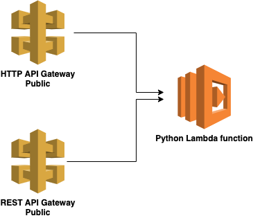

terraform-lambda-api
--------------------

This demo stack deploys the REST and HTTP API Gateway using TerraForm. A Lambda function receives the requests from the gateways and returns the request headers.

In a production scenario, you may choose to deploy individual Lambda functions per API Gateway instead of reusing one function. 

Installation
------------

Edit the values in 'variables.tf'. Next, run 'terraform init' and 'terraform apply' to deploy to AWS.
